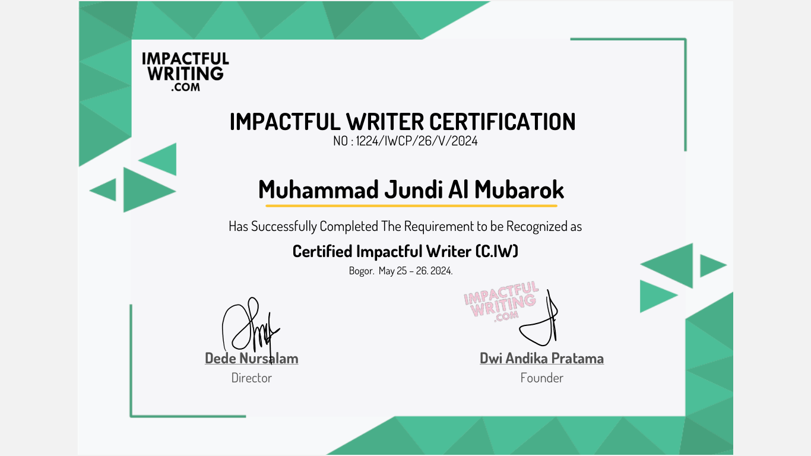

## Siapa Saya

Halo! Kenalan lebih dekat dengan Jundi, yuk.

​Siapa Saya
Hai, saya Jundi! Terima kasih ya sudah mampir ke sini.

​Kalau ditanya apa kesibukan saya, sehari-hari saya bekerja sebagai Operator Sekolah. Tapi di waktu luang, saya punya hobi yang cukup spesifik: ngulik website! Saya jatuh cinta dengan konsep static website. 

Blog yang sedang Anda baca ini menggunakan Hugo. Kenapa? Karena saya suka yang cepat, ringan, dan nggak ribet. 

Saya hanya ingin berbagi cerita lewat artikel tanpa harus membebani server dengan fitur-fitur yang sebenarnya tidak saya butuhkan.

### Cerita di Balik Blog Ini

Bagi saya, bisa merilis blog statis seperti ini adalah kebanggaan tersendiri. Memang tantangannya lumayan, karena rata-rata panduannya masih bahasa Inggris dan komunitasnya di Indonesia belum sebesar platform lain. Tapi justru di situ serunya!

### Langkah Selanjutnya: Menulis dengan Hati

Bagi saya, teknologi hanyalah sebuah wadah. Isinya? Tentu saja kata-kata.

Beberapa waktu lalu, saya memutuskan untuk melangkah lebih jauh dengan menyelesaikan pembelajaran daring di **[impactfulwriting](https://certifiedimpactfulwriter.com)**. Hasilnya? Saya berhasil mengantongi sertifikat pertama saya di dunia kepenulisan!

Ini bukan sekadar pencapaian di atas kertas, melainkan janji saya kepada diri sendiri (dan Anda sebagai pembaca) untuk terus mengasah kemampuan dalam merangkai kalimat. Saya ingin setiap tulisan di blog ini tidak hanya sekadar lewat, tapi bisa meninggalkan kesan dan dampak positif.

### Kesimpulan

Nah, sekarang Anda sudah sedikit mengenal siapa saya. Tapi, sebuah blog tidak akan hidup tanpa interaksi, jadi saya sangat berharap bisa mengenal Anda juga melalui kolom komentar atau kontak yang tersedia!

Bisa juga lewat form dibawah ini 

 

Blog ini dikelola dan dibiayai sepenuhnya secara mandiri. Saya sangat mengandalkan dukungan tulus dari para pembaca untuk menjaga dapur "digital" ini tetap mengepul.

Jika Anda merasa tulisan saya bermanfaat atau sekadar ingin memberi semangat, Anda bisa memberikan apresiasi dalam bentuk donasi (sekali saja atau rutin). Dukungan sekecil apa pun sangat berarti untuk kelangsungan blog ini.

Terima kasih sudah mampir!

Dukung saya [disini](https://nihbuatjajan.com/jundi)

Salam hangat,
Jundi

---