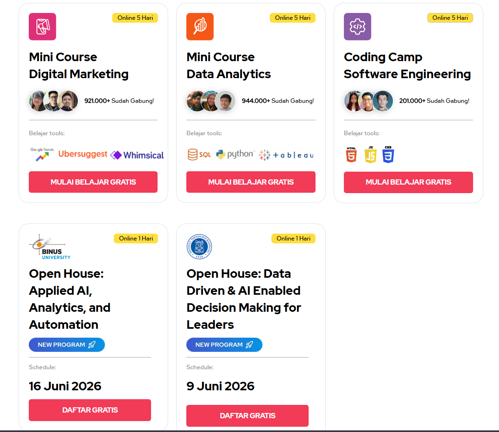

Saya tertarik dengan hal berbau teknologi dan pekan lalu saya menemukan ada bootcamp gratis dari Revou.co, saat itu iklan yang muncul adalah kelas gratis tentang pengenalan **Software Engineering**.

Bootcamp yang dilaksanakan selama kurang lebih 5 hari ini berisi tentang pengenalan secara garis besar tentang apa itu software engineering dan apa manfaatnya di dunia kerja, dan pengenalan tentang HTML, CSS Tailwind, Javasript serta penggunaan Kiro AI untuk membantu koding dengan menggunakan AI.

Selain itu di akhir bootcamp ada 2 tugas wajib yang harus di selesaikan semacam mini project yang bisa dijadikan juga untuk portfolio kamu, yaa lumayanlahh.. menurut saya kelas ini sudah cukup bagus nih buat awal belajar pemrograman karena di kelas gratis ini selain dapet mini project yang bisa kita kerjakan, ada juga E-Certificate kalau kita hadir full selama 5 hari dan mengerjakan seluruh tugas yang diberikan RevoU.

Oiya RevoU juga menyediakan kelas gratis lainnya bukan hanya Software engineering saja, ada kelas Digital Marketing dan Juga Data Analytics.

Pastinya ada kelas lanjutan yang harganya belasan juta hingga menyentuh angka 20 juta rupiah yang berlangsung selama 6-8 bulan.

Melalui kelas dari RevoU ini kita bisa mencicipi bagaimana ekosistem pembelajaran disini sebelum membeli kelas versi fullnya, jadi kita bisa merasakan apakah cocok atau ngga dengan sistem belajar mereka, jadi ngga ada salahnya ikutan kelas gratis ini yang bahkan hampir dilaksanakan setiap pekan oleh tim RevoU ini.

Jangan lupa siapin perangkatnya yaa..

So, gimana kamu tertarik ikutan kelas gratis ini? coba deh kamu klik [akses ini](https://www.revou.co/important-links) ada kelas yang dilaksanakan selama 1 hari juga, dan 3 kelas yang sudah saya sebutkan diatas dilaksanakan selama 5 hari. 

Oke silahkan dicoba yaa, semoga rezeki kalian ada dibidang itu. Good Luck. :)
