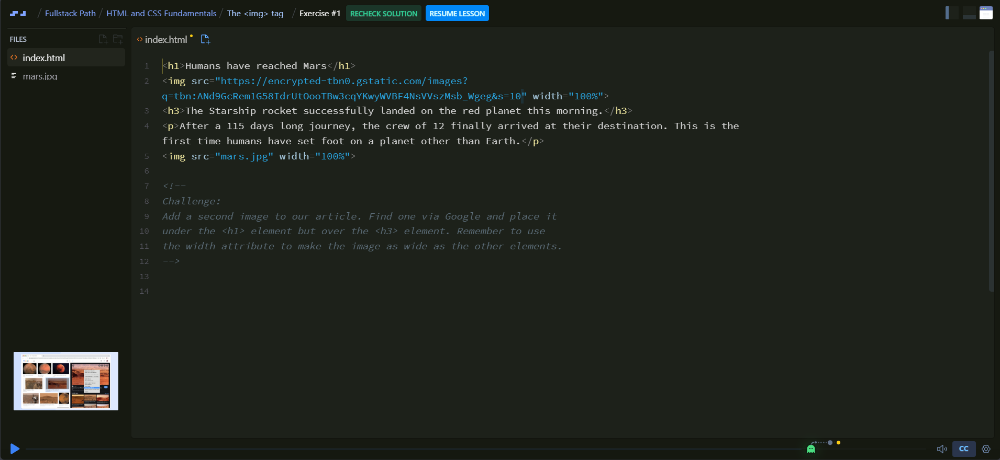

Setelah ikutan [minibootcamp](https://jundi.web.id/posts/bootcamp-gratis/) dari RevoU selama 5 hari tentang pengenalan software engineer saya merasa bahwa ini merupakan awal lembaran baru, istilahnya baru buka halaman kata pengantarnya saja.

Karena sesi yang berlangsung 1 jam setengah ini terasa begitu singkat, kita hanya mencicipi secuil materi dari seluruh materi yang berlangsung selama kurang lebih 6 bulan jika membeli versi full stacknya tergantung dari kelas mana yang kita pilih.

Namun bukan berarti ini percuma, dari sini kita tahu roadmap atau setidaknya gambaran awal kita harus belajar apa dulu, saya mengikuti seluruh kegiatan dari awal sampai akhir dan mengisi absensi tidak lupa juga mengerjakan 2 tugas wajib dari tim RevoU.

Entah saya lupa klik kehadiran atau tugas yang saya kerjakan tidak mendapatkan nilai yang memuaskan sehingga tidak bisa mendapatkan sertifikat dari tim RevoU, tapi saya tidak berkecil hati karena yang penting ilmu yang kita dapatkan dari mereka bisa kita kembangkan kembali.

Ada 1 website yang saya pikir website ini sempurna untuk belajar pemrograman awal, serta bisa mendapatkan sertifikat juga tapi memang harus membayar versi premiumnya dan diperbaharui tiap bulan.

Berita baiknya kita bisa tetap mengakses seluruh kelas dan belajar apa yang mereka sediakan disana, berita kurang baiknya kita harus membayar dengan harga yang lumayan karena nilai rupiah sedang turun drastis dan mereka menggunakan kurs US Dollar.

Pada website ini kita bisa langsung praktikkan setelah menonton video yang mereka sediakan, alih alih membagi 1 layar menjadi 2 jendela, mereka menyediakan 1 halaman full yang bisa kita praktekkan setelah kita menonton video penjelasan dari mereka dan bisa kita *check solution* apakah jawaban kita sudah tepat atau belum.

Jika belum tepat mereka akan memberikan hint atau penjelasan apa yang kurang dari kode kita.

1 layar full berisi halaman yang bisa kita ketikkan kode tanpa harus menggunakan text editor seperti Visual Studi Code atau semacamnya, dan sebelah kiri ada mini player yang otomatis akan ter-*minimize* atau *pop-up*  jika dibutuhkan.

Sehingga kita tidak perlu membuka 2 jendela dalam 1 layar yang sama. 

Menarik bukan?
