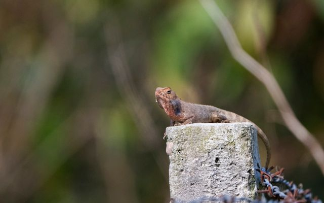

*“Mobil favorit kamu apa dek?”*

*“Mobil yang ngga bikin mabuk”*

\---

*“Rumah yang gada cicaknya”*.
ucap wanita yang telah tinggal bersamaku hampir 5 tahun lamanya, saatku bertanya rumah yang menarik untuknya yang modelnya seperti apa.
Ya, hewan yang sangat ditakuti olehnya mungkin lebih tepatnya “geli”.

Hewan yang selalu membuat kejutan yang muncul ditempat tak terduga, saat membuka pintu kamar mandi dan muncul dari balik engsel pintu yang berkarat.  

Terkadang muncul ketika ingin membuang air dari belakang kulkas dari lelehan bunga es *freezer* dari kulkas lama yang bekas almarhum nenek saya.

Hewan yang dahulu sering saya bunuh ketika masih kecil,dan sekarang saya pun malah ikut-ikutan 'geli' saat melihat dinding dirayapi oleh hewan *mimikri* ini.

Kata salah satu channel youtube : alam semenit. \
Hewan ini sering kali muncul di tempat hangat, makanya seringnya muncul di malam haridan bersembunyi di balik pintu, di bawah kulkas, dan sudah pasti di dapur yangsepertinya masih menyimpan hawa panas yang tersimpan saat memasak untuk makanmalam tadi.

Kadang saya merasa agak pyscopat ketika memukul bahkanmenggencet mereka dengan rel gordyn bekas yang tak terpakai lagi bahkan ujungnysudah penyok karena pukulan yang agak keras. 

Puas rasanya ketika ekor mereka terputus dan mulaisekarat, tapi saya berpikir lagi dalam agama islam ketika berhasil membunuhhewan ini dalam sekali pukulan maka pahaklanya akan sempurna, tetapi ketikagagal dan berkali-kali percobaan maka pahala berkurang di setiap pukulan sampaipada akhirnya mati.

Ya hewan menyebalkan kedua setelah tikus yang palingsering muncul di dinding rumah kontrakan ini sungguh membuat saya berpikirapakah ada dinding yang anti ketempelan cicak, jika ada sepertinya akan sangatmahal harganya.

Sebaliknya, kalau saya melihat kecoa terbang saya panik,istri saya malah sebaliknya. Senang.

Senang melihat suaminya panik. Parah banget.

Untungnya istri malah berani pegang dengan tanganlangsung walau tetap saja dibungkus kresek karena merasa kecoa adalah hewan yangkotor dan punya bau yang tidak mengenakkan di hidung.

Kalau saya yaa agak was was walaupun masih “bisa”diusahakan pegang dan dibuang sendiri oleh saya.

Walau seringnya saya pukul menggunakan sapu lidi yang fungsinyaselain buat menebah kasur buat tidur tetapi malah kadang buat pukul kecoa juga.

Harus dengan tenaga yang pas ketika memukul, jika terlalupelan ya akan kabur lagi, tapi kalau terlampau keras malah jadi kaya kecoa ‘moncrot’ alih alih hanya kena lantai, kena sapu juga yang buat tebah kasur tidur.
